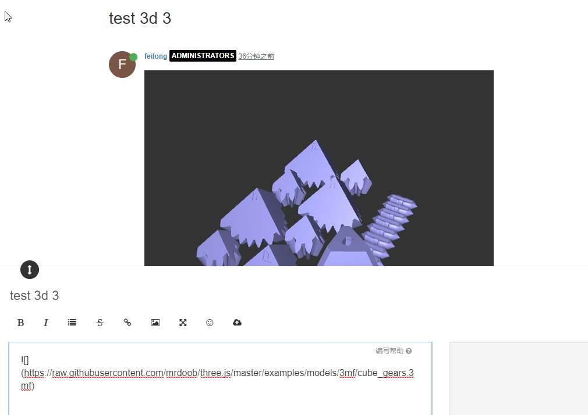

# NodeBB BiliBili Plugin

This NodeBB plugin allows users to show .gltf 3d object in their posts.

## Installation

    npm install nodebb-plugin-three-gltf

## screenshots

show with [https://raw.githubusercontent.com/mrdoob/three.js/master/examples/models/gltf/cube_gears.gltf](https://raw.githubusercontent.com/mrdoob/three.js/master/examples/models/gltf/cube_gears.gltf)

## known issus

Can not load gltf files which generate by Microsoft 3D Builder.
> [https://github.com/mrdoob/three.js/issues/12640](https://github.com/mrdoob/three.js/issues/12640)

